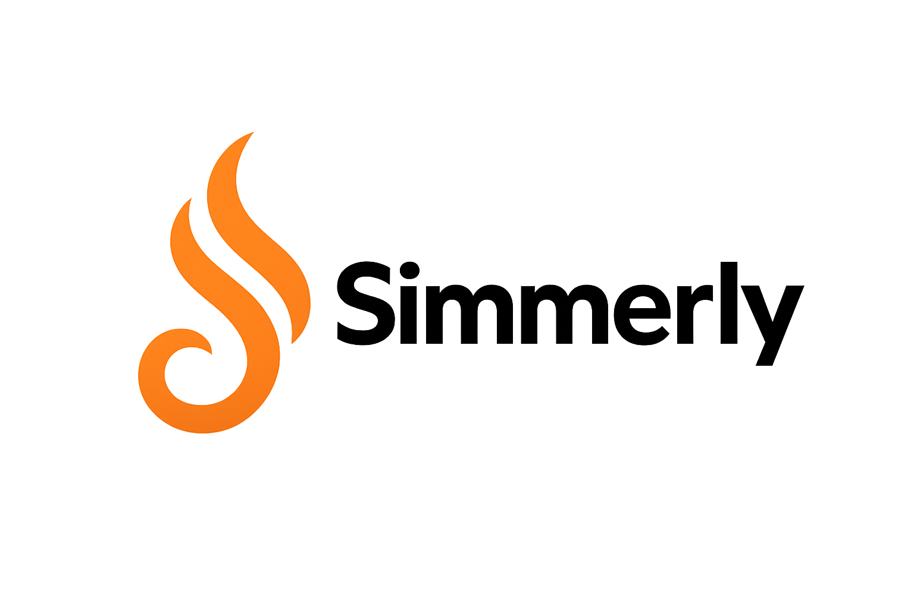

<picture>
        <source media="(prefers-color-scheme: dark)" srcset="docs/media/logo/simmerly_logo_text_white.png">
        <source media="(prefers-color-scheme: light)" srcset="docs/media/logo/simmerly_logo_text_black.png">
        
</picture>

 
 

Simmerly is a Free and Open Source (FOSS) frontend client for [Mealie](https://mealie.io/), the self-hosted recipe manager. It brings the power of Mealie to your fingertips on Android, iOS, and desktop platforms.

## Libraries
- [Material 3](https://m3.material.io/components) components.
- [Compose multiplatform](https://github.com/JetBrains/compose-multiplatform)
- [Coroutines](https://github.com/Kotlin/kotlinx.coroutines) for asynchronous operations.
- [Decompose](https://github.com/arkivanov/Decompose) for lifecycle management and navigation.
- [Kotlin Serialization](https://github.com/Kotlin/kotlinx.serialization)
- [Ktor](https://github.com/ktorio/ktor) for network requests.
- [Koin](https://github.com/InsertKoinIO/koin) dependency injection framework.
- MVI Architecture with [MVIKotlin](https://github.com/arkivanov/MVIKotlin/)

## Platforms

* Android
* iOS
* Desktop (Windows, macOS, Linux)

## License

This project is licensed under the Apache License, Version 2.0. See the [LICENSE](LICENSE) file for details.
